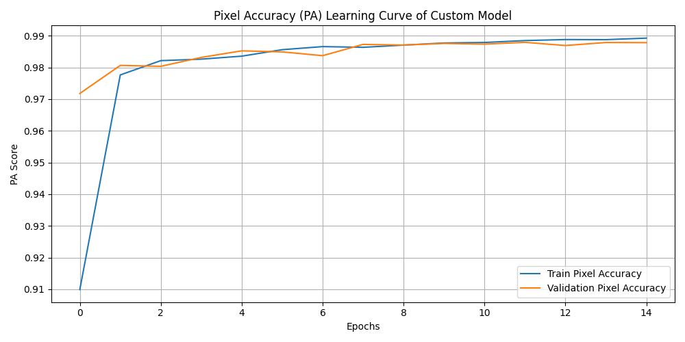
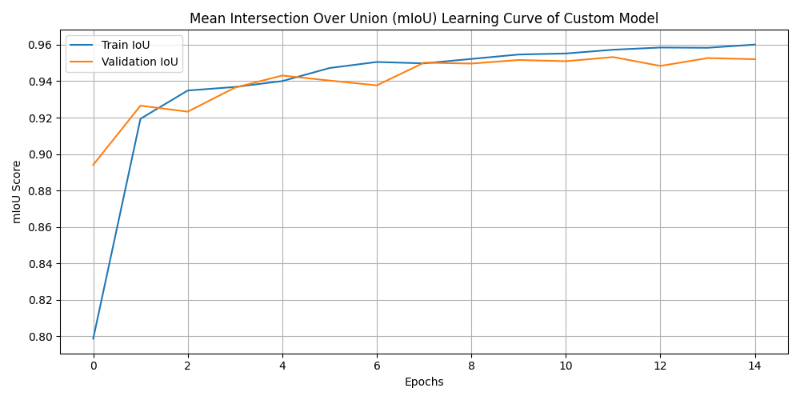
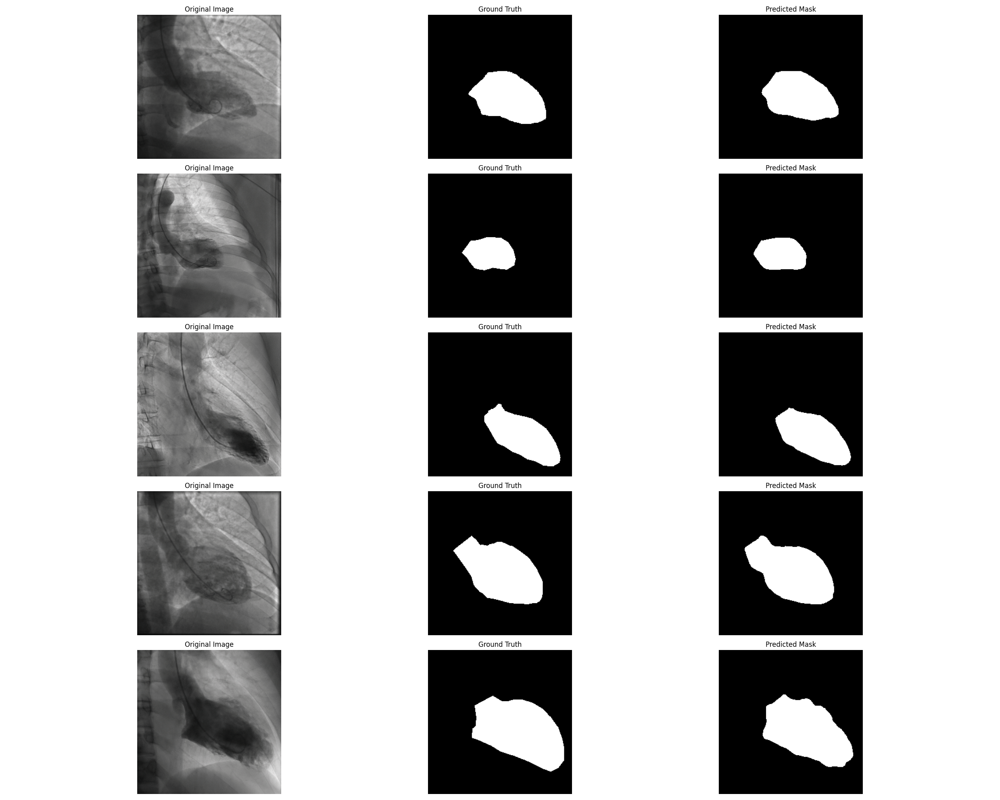

# 🩺 Medical Image Segmentation with UNet Model

This project features segmenting medical images of cardiac disease using UNet model built from scratch based on the official paper.

You can also deploy this model using streamlit and convert your saved model to onnx file using corresponding files.

---

## 📊 Project Overview

- **Task**: Medical Image Semantic Segmentation
- **Dataset**: Medical Images of Cardiac Disease
- **Model**: UNet (without using pre-trained models)
- **Framework**: PyTorch
- **Evaluation Metrics**: mean intersection over union, pixel accuracy, and generated masks

---

## 🏗️ UNet Model

The UNet model used is a Pytorch implementation of the original UNet based on the official paper.

---

## 📈 Training & Validation Curves

Here is the **Pixel Accuracy** curve over epochs:

### Pixel Accuracy


---

## 🧮 Mean Intersection Over Union (mIoU)

The **mIoU** plot below illustrates the model's performance in the given dataset:



---

## 🧠 Mask Visualization

Generated masks of the model:



---


## 🚀 How to Run

1. Clone the repository:
   
   ```
   git clone https://github.com/akhra92/Cardiac-Semantic-Segmentation.git
   cd cardiac-semantic-segmentation
   ```

3. Install dependencies:

   ```
   pip install -r requirements.txt
   ```
   
4. Train and test the model:

   ```
   python main.py
   ```

5. Deploy in local using streamlit:
   
   ```
   streamlit run demo.py
   ```

6. Convert to onnx file:
   
   ```
   python convert_onnx.py
   ```


